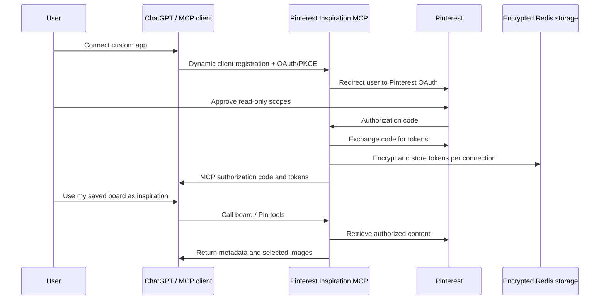

# Pinterest Inspiration MCP

A production-oriented, **read-only Pinterest connector for ChatGPT and other MCP clients**.

Creators often keep their best visual references inside Pinterest boards, but have to manually paste screenshots into ChatGPT before asking for Instagram posts, carousels, captions, art direction, or image prompts. This project lets each user authorize their own Pinterest account once, then allows an MCP-compatible AI assistant to retrieve selected boards, Pins, metadata, and a limited set of actual Pin images for multimodal analysis.

> This connector does **not** publish, edit, move, or delete Pins. It requests only Pinterest read scopes.

## What it enables

Users can ask an AI assistant to:

- list their Pinterest boards;
- inspect one board and its Pins;
- load selected Pin images into the conversation;
- find recurring visual patterns such as palette, composition, typography, lighting, styling, and layout;
- use those patterns to create more relevant Instagram concepts, captions, carousels, briefs, and image-generation prompts; and
- search Pin metadata across selected boards before opening the strongest references.

## Architecture



### Authorization layers

There are two separate OAuth relationships:

1. **MCP client → this server** using dynamic client registration, authorization code flow, PKCE, access tokens, and refresh tokens.
2. **This server → Pinterest** using Pinterest OAuth and the minimum board and Pin read scopes.

Each Pinterest connection receives a separate internal connection ID. Pinterest tokens are encrypted before storage and are never committed to GitHub.

## MCP tools

| Tool | Purpose |
| --- | --- |
| `list_pinterest_boards` | List the connected user’s boards with pagination and optional privacy filtering. |
| `get_pinterest_board` | Retrieve metadata for one board. |
| `list_board_pins` | List Pin metadata and image URLs from one board. |
| `get_pin_details` | Retrieve full metadata for one Pin. |
| `get_board_inspiration_images` | Load up to eight actual Pin images into the AI conversation for visual analysis. |
| `search_saved_pin_metadata` | Best-effort keyword matching over Pin titles, descriptions, alt text, and links across selected boards. |

All exposed Pinterest tools are annotated as read-only, non-destructive, and idempotent.

## Technology

- Next.js App Router
- TypeScript
- `mcp-handler` and the Model Context Protocol SDK
- Pinterest API v5
- Upstash Redis or Vercel KV-compatible REST credentials
- AES-256-GCM encryption for stored Pinterest tokens
- Vercel deployment

## Requirements

- Node.js 20 or newer
- A Pinterest business account and Pinterest developer app
- Pinterest Trial access for initial testing and Standard access for a production product
- A Vercel account
- An Upstash Redis database, or a compatible Vercel Marketplace Redis integration
- A ChatGPT plan/workspace that supports custom MCP apps in developer mode

Pinterest’s official developer documentation states that API access requires a business account. Trial access is intended for testing; Pinterest recommends Standard access for production and requires a working OAuth flow, public privacy policy, and video demo during review.

## Local setup

```bash
npm install
cp .env.example .env.local
npm run dev
```

Open `http://localhost:3000`.

Generate the encryption key with:

```bash
openssl rand -base64 32
```

For local Pinterest OAuth testing, register this callback URL in the Pinterest developer app:

```text
http://localhost:3000/oauth/pinterest/callback
```

Pinterest must allow the exact callback URL. For production, use the deployed HTTPS URL instead.

## Environment variables

| Variable | Required | Description |
| --- | --- | --- |
| `APP_URL` | Production | Canonical public URL without a trailing slash. Example: `https://your-project.vercel.app`. |
| `PINTEREST_APP_ID` | Yes | Pinterest developer app ID. |
| `PINTEREST_APP_SECRET` | Yes | Pinterest developer app secret. Never expose it client-side. |
| `PINTEREST_INCLUDE_SECRET_SCOPES` | No | Set to `true` only when secret-board access is necessary and approved. |
| `UPSTASH_REDIS_REST_URL` | Yes | Upstash Redis REST endpoint. `KV_REST_API_URL` is also accepted. |
| `UPSTASH_REDIS_REST_TOKEN` | Yes | Upstash Redis REST token. `KV_REST_API_TOKEN` is also accepted. |
| `TOKEN_ENCRYPTION_KEY` | Yes | Exactly 32 random bytes encoded as base64. |
| `LEGAL_ENTITY_NAME` | Public launch | Name shown in privacy and terms pages. |
| `SUPPORT_EMAIL` | Public launch | Monitored support/privacy contact shown on legal pages. |

## Deploy to Vercel

1. Import this GitHub repository into Vercel.
2. Add an Upstash Redis integration from the Vercel Marketplace, or add the Redis REST variables manually.
3. Add all variables from `.env.example` to the Vercel project.
4. Deploy once to obtain the final public domain.
5. Set `APP_URL` to that final domain and redeploy.
6. In the Pinterest developer app, register the exact callback:

```text
https://YOUR-DOMAIN/oauth/pinterest/callback
```

7. Open `/api/health`. It should return HTTP `200` with every check set to `true`.
8. Complete the Pinterest and ChatGPT verification steps in the documentation.

Full instructions: [`docs/DEPLOYMENT.md`](docs/DEPLOYMENT.md)

## Connect in ChatGPT

The remote MCP endpoint is:

```text
https://YOUR-DOMAIN/api/mcp
```

In ChatGPT developer mode, create a custom app, enter the endpoint, scan tools, and complete the OAuth prompt. The server exposes the OAuth authorization-server and protected-resource metadata required for discovery.

Current ChatGPT availability and menus can change. Follow OpenAI’s current developer-mode documentation when connecting the app:

- https://help.openai.com/en/articles/12584461-developer-mode-apps-and-full-mcp-connectors-in-chatgpt-beta
- https://help.openai.com/en/articles/11487775-connectors-in-chatgpt

Detailed steps: [`docs/CHATGPT_SETUP.md`](docs/CHATGPT_SETUP.md)

## Pinterest access and review

The app requests:

```text
boards:read
pins:read
```

Optional secret-board access requests:

```text
boards:read_secret
pins:read_secret
```

Do not enable secret scopes unless the product genuinely needs them and the Pinterest app has the corresponding access.

Important official references:

- OAuth and scopes: https://developers.pinterest.com/docs/getting-started/set-up-authentication-and-authorization/
- Connect an app: https://developers.pinterest.com/docs/getting-started/connect-app/
- Access tiers: https://developers.pinterest.com/docs/key-concepts/access-tiers/

A review-ready app description and demo script are provided in [`docs/PINTEREST_REVIEW.md`](docs/PINTEREST_REVIEW.md).

## Health and status

The landing page displays configuration status without revealing secret values.

The JSON health endpoint is:

```text
GET /api/health
```

It verifies:

- canonical public URL configuration;
- Pinterest app credentials;
- valid token-encryption key length;
- Redis credentials; and
- live Redis connectivity.

It cannot complete a real Pinterest OAuth flow without a Pinterest app and consenting test account. Use [`docs/VERIFICATION.md`](docs/VERIFICATION.md) for the full end-to-end checklist.

## Security model

- Pinterest credentials are exchanged only server-side.
- Pinterest access and refresh tokens are encrypted using AES-256-GCM before Redis storage.
- MCP authorization uses PKCE and short-lived authorization codes.
- OAuth state is single-use and short-lived.
- Pinterest scopes are read-only and minimized.
- Secrets and `.env` files are excluded from Git.
- Downloaded images are returned on demand and are not intentionally persisted by this application.
- Dynamic client registration permits HTTPS redirect URIs and localhost during development.

Before a broad public launch, complete a dedicated security review, add rate limiting and abuse monitoring appropriate to expected traffic, configure a real legal entity and contact address, and review data-processing agreements with infrastructure providers.

See [`SECURITY.md`](SECURITY.md) for reporting guidance and production-hardening notes.

## Verification commands

```bash
npm install
npm run typecheck
npm run build
```

GitHub Actions runs the same checks on every push and pull request.

## Repository documentation

- [Vercel deployment](docs/DEPLOYMENT.md)
- [ChatGPT custom app setup](docs/CHATGPT_SETUP.md)
- [Pinterest access-review preparation](docs/PINTEREST_REVIEW.md)
- [End-to-end verification](docs/VERIFICATION.md)
- [Security policy](SECURITY.md)
- [Privacy policy route](app/privacy/page.tsx)
- [Terms route](app/terms/page.tsx)

## Limitations

- `search_saved_pin_metadata` searches a limited page of Pin metadata; it is not Pinterest’s global visual-search engine.
- Visual analysis is limited to a small number of images per tool call to control payload size and latency.
- Pinterest and ChatGPT access requirements can change.
- A deployed server with environment variables is not fully verified until a real user completes Pinterest OAuth and invokes the MCP tools from ChatGPT.

## License

MIT. See [`LICENSE`](LICENSE).

Pinterest is a trademark of Pinterest, Inc. This project is not affiliated with or endorsed by Pinterest unless explicitly stated otherwise.
